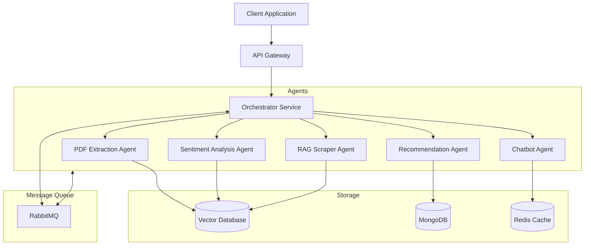

# UMBRELLA-AI System Architecture

## Overview

UMBRELLA-AI is designed as a distributed multi-agent system leveraging microservices architecture. Each component is containerized and can be scaled independently, communicating through well-defined APIs and message queues.

## System Components

### 1. Orchestrator Service
- **Purpose**: Central coordination of all AI agents and task management
- **Responsibilities**:
  - Task decomposition and distribution
  - Request routing
  - Response aggregation
  - State management
  - Error handling and retries
- **Technologies**:
  - FastAPI for API endpoints
  - Gemini API (gemini-2.0-flash-thinking-exp model)
  - Redis for state management
  - RabbitMQ for message queuing

### 2. PDF Extraction Agent
- **Purpose**: Document analysis and structured data extraction
- **Responsibilities**:
  - PDF parsing and text extraction
  - Image extraction and analysis
  - Table structure recognition
  - Metadata extraction
- **Technologies**:
  - Gemini API (gemini-2.0-flash-exp model)
  - PyPDF2 for PDF processing
  - Tesseract OCR for image text extraction
  - pdf2image for conversion

### 3. Sentiment Analysis Agent
- **Purpose**: Text sentiment and emotion analysis
- **Responsibilities**:
  - Text sentiment classification
  - Emotion detection
  - Context understanding
  - Temporal sentiment tracking
- **Technologies**:
  - Gemini API (gemini-2.0-flash-exp model)
  - Transformers for model inference
  - Vector database for context storage

### 4. Recommendation Agent
- **Purpose**: Intelligent product and action suggestions
- **Responsibilities**:
  - User preference analysis
  - Product/action matching
  - Contextual recommendations
  - Feedback incorporation
- **Technologies**:
  - Gemini API (gemini-2.0-flash-exp model)
  - Vector database for similarity search
  - MongoDB for user preferences

### 5. Chatbot Agent
- **Purpose**: Natural language interaction
- **Responsibilities**:
  - User query understanding
  - Context maintenance
  - Response generation
  - Multi-turn conversation
- **Technologies**:
  - Gemini API (gemini-2.0-flash-exp model)
  - LangChain for conversation management
  - Redis for session management

### 6. RAG Scraper Agent
- **Purpose**: Web data collection and processing
- **Responsibilities**:
  - Web scraping
  - Content extraction
  - Information synthesis
  - Knowledge base updates
- **Technologies**:
  - Playwright for web automation
  - BeautifulSoup for parsing
  - ChromaDB for vector storage
  - LangChain for RAG implementation

## Data Flow

## Communication Patterns

1. **Synchronous Communication**:
   - REST APIs for client-facing interfaces
   - gRPC for internal service communication
   - WebSocket for real-time updates

2. **Asynchronous Communication**:
   - RabbitMQ for task distribution
   - Redis pub/sub for notifications
   - Event-driven architecture

## Security Architecture

1. **Authentication & Authorization**:
   - JWT-based authentication
   - Role-based access control
   - API key management

2. **Data Security**:
   - End-to-end encryption
   - Secure credential storage
   - AWS Secrets Manager integration

## Scalability Considerations

1. **Horizontal Scaling**:
   - Containerized services
   - Kubernetes orchestration
   - Auto-scaling policies

2. **Performance Optimization**:
   - Redis caching
   - Connection pooling
   - Load balancing

## Monitoring and Observability

1. **Metrics Collection**:
   - Prometheus for metrics
   - Grafana for visualization
   - Custom dashboards

2. **Logging and Tracing**:
   - Distributed tracing
   - Centralized logging
   - Error tracking

## Development Workflow

1. **Local Development**:
   - Docker Compose setup
   - Hot reloading
   - Debug configurations

2. **Testing Strategy**:
   - Unit tests per service
   - Integration tests
   - End-to-end testing

## Deployment Architecture

1. **AWS Infrastructure**:
   - ECS/EKS for container orchestration
   - VPC networking
   - Load balancing

2. **CI/CD Pipeline**:
   - Automated testing
   - Continuous deployment
   - Environment promotion

## Future Considerations

1. **Planned Enhancements**:
   - Additional AI agents
   - Advanced caching strategies
   - Multi-region deployment

2. **Technical Debt Management**:
   - Regular dependency updates
   - Code quality monitoring
   - Performance optimization

## Decision Log

### Key Architecture Decisions

1. **Microservices Architecture**
   - **Decision**: Use microservices for each AI agent
   - **Rationale**: Enables independent scaling and deployment
   - **Consequences**: Increased operational complexity

2. **Message Queue Implementation**
   - **Decision**: Use RabbitMQ for async communication
   - **Rationale**: Reliable message delivery and routing
   - **Consequences**: Additional infrastructure management

3. **Vector Database Choice**
   - **Decision**: Use ChromaDB for vector storage
   - **Rationale**: Optimized for AI embeddings
   - **Consequences**: Limited cloud-managed options

4. **API Gateway Pattern**
   - **Decision**: Implement API Gateway for client requests
   - **Rationale**: Centralized request handling and security
   - **Consequences**: Additional latency layer 