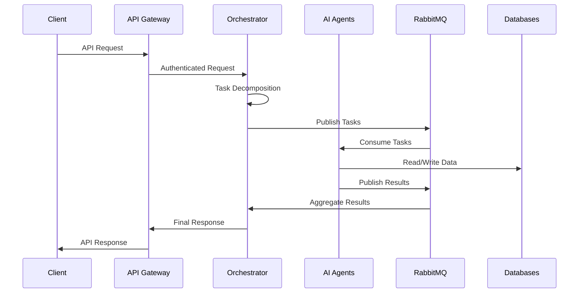
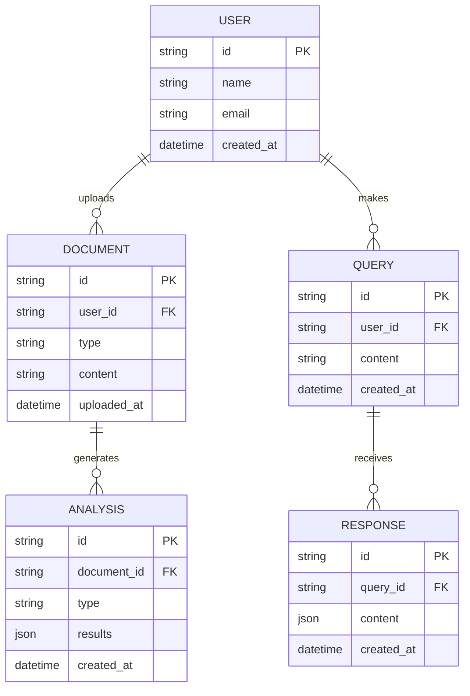

# UMBRELLA-AI Architecture Diagrams

## System Overview

```mermaid
graph TB
    Client[Client Applications] --> Gateway[API Gateway]
    Gateway --> Auth[Authentication Service]
    Gateway --> Orchestrator[Orchestrator Service]
    
    subgraph "AI Agents"
        Orchestrator --> PDF[PDF Extraction Agent]
        Orchestrator --> Sentiment[Sentiment Analysis Agent]
        Orchestrator --> Recommend[Recommendation Agent]
        Orchestrator --> Chat[Chatbot Agent]
        Orchestrator --> RAG[RAG Scraper Agent]
    end
    
    subgraph "Data Storage"
        MongoDB[(MongoDB)]
        VectorDB[(ChromaDB)]
        Redis[(Redis Cache)]
    end
    
    subgraph "Message Queue"
        RabbitMQ{RabbitMQ}
    end
    
    PDF --> VectorDB
    Sentiment --> VectorDB
    Recommend --> MongoDB
    Chat --> Redis
    RAG --> VectorDB
    
    Orchestrator <--> RabbitMQ
    AI Agents <--> RabbitMQ
```

## Request Flow



## Deployment Architecture

```mermaid
graph TB
    subgraph "AWS Cloud"
        ALB[Application Load Balancer]
        
        subgraph "ECS/EKS Cluster"
            API[API Gateway Service]
            Auth[Auth Service]
            Orch[Orchestrator Service]
            Agents[AI Agent Services]
        end
        
        subgraph "Data Layer"
            RDS[(MongoDB)]
            ElastiCache[(Redis)]
            S3[(S3 Storage)]
        end
        
        subgraph "Message Queue"
            MQ[RabbitMQ Cluster]
        end
        
        subgraph "Monitoring"
            Prom[Prometheus]
            Graf[Grafana]
            Logs[CloudWatch]
        end
    end
    
    Internet((Internet)) --> ALB
    ALB --> API
    API --> Auth
    API --> Orch
    Orch --> Agents
    Agents --> RDS
    Agents --> ElastiCache
    Agents --> S3
    Orch <--> MQ
    Agents <--> MQ
    
    ECS/EKS Cluster --> Prom
    Prom --> Graf
    ECS/EKS Cluster --> Logs
```

## Data Model

